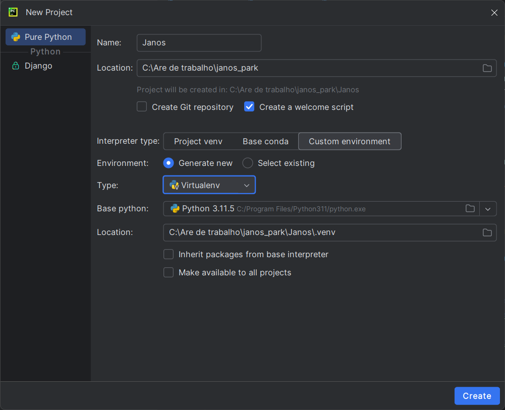

## Prévia do CRUD de funcionários

Sobre o Projeto

Anotações de do Projeto

## Instalação
### Clone este repositório.

  ```
  git clone https://github.com/Dev-JoaoM/Janos-Park-Project.git
  ```
### Crie um Projeto como na imagem
  

	


### Ative o ambiente

### Ative o ambiente

```	
.venv/Scripts/Activate
```	

### Instale os requerimentos (Bibliotecas usadas)
```
pip install -r requirements.txt
```

## Execute as migrações (Criação do arquivo do BD)
  ```
  python manage.py migrate
  ```

## Inicie o servidor
  ```
  python manage.py runserver
  ```	